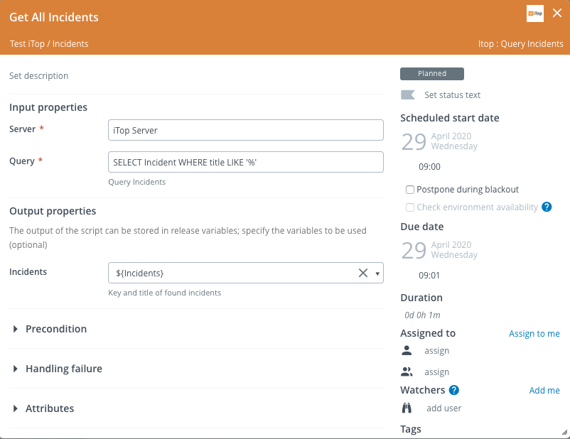
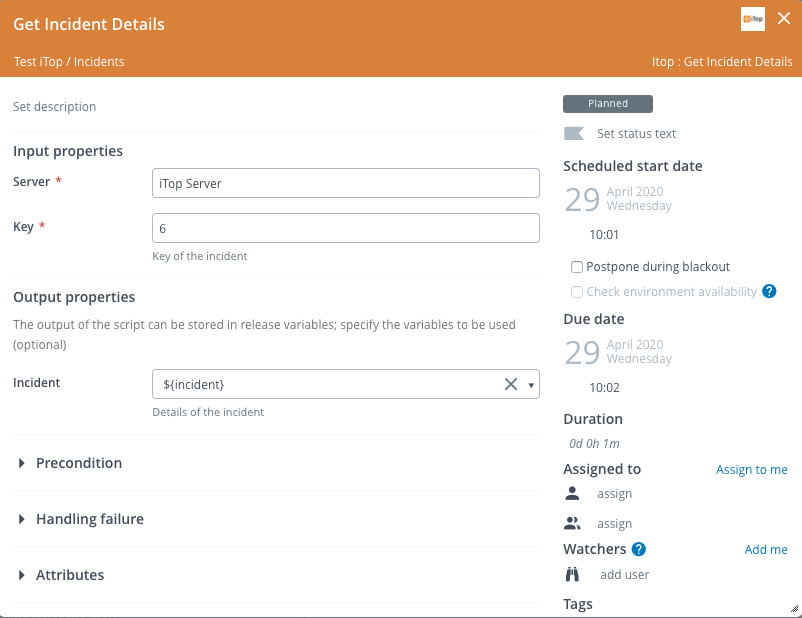
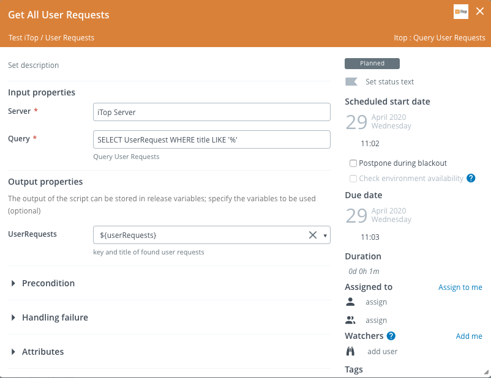
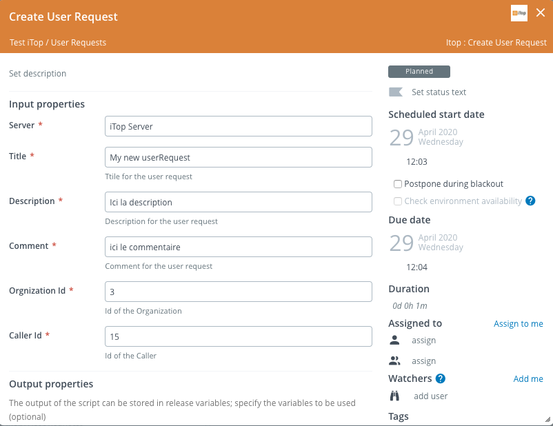

# XL Release iTop plugin

[![Build Status][xlr-itop-plugin-travis-image]][xlr-itop-plugin-travis-url]
[![License: MIT][xlr-itop-plugin-license-image]][xlr-itop-plugin-license-url]
![Github All Releases][xlr-itop-plugin-downloads-image]

[xlr-itop-plugin-travis-image]: https://travis-ci.org/xebialabs-community/xlr-itop-plugin.svg?branch=master
[xlr-itop-plugin-travis-url]: https://travis-ci.org/xebialabs-community/xlr-itop-plugin
[xlr-itop-plugin-license-image]: https://img.shields.io/badge/License-MIT-yellow.svg
[xlr-itop-plugin-license-url]: https://opensource.org/licenses/MIT
[xlr-itop-plugin-downloads-image]: https://img.shields.io/github/downloads/xebialabs-community/xlr-itop-plugin/total.svg

## Preface

This document describes the functionality provided by the XL Release iTop plugin.

See the [XL Release reference manual](https://docs.xebialabs.com/xl-release) for background information on XL Release and release automation concepts.  

## Overview

The xlr-itop-plugin is an XL Release plugin to integrate with iTop server.

## Requirements

Note:  XLR version should not be lower than lowest supported version.  See <https://support.xebialabs.com/hc/en-us/articles/115003299946-Supported-XebiaLabs-product-versions>.

## Installation

* Copy the latest JAR file from the [releases page](https://github.com/xebialabs-community/xlr-itop-plugin/releases) into the `RELEASE_SERVER/plugins` directory.
* Restart the XL Release server.

## Usage

### Query Incidents Task

### Get Incident Details Task

### Query User Requests Task

### Create User Request Task

### Get User Request Details Task

## References

* [iTop Hub](https://www.itophub.io/)

## History

|  Version |  Date | Description  |
|---|---|---|
|  1.0.0 | May 5, 2020  | Initial version (for demo purpose)  |
